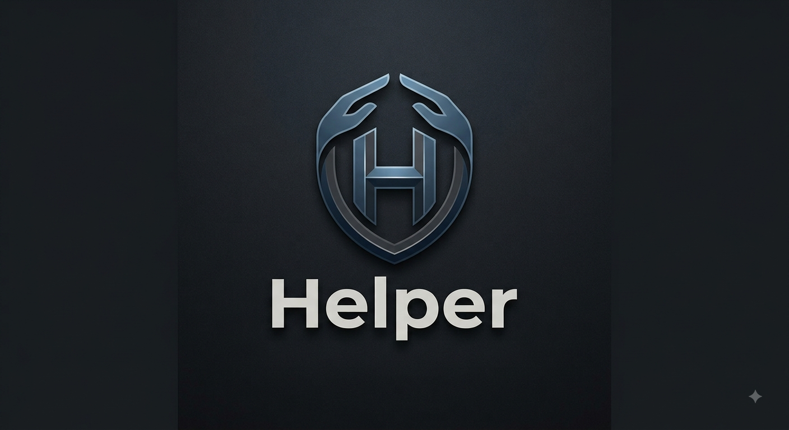

# 📱 Helper — Personal Lifestyle, Productivity & Security PWA

  

  
  
  
  
  

**Helper** — это автономное прогрессивное веб-приложение (PWA) для комплексного управления повседневной жизнью, здоровьем, личными финансами, паролями и файлами в едином защищённом интерфейсе.

---

## 🚀 Ключевые возможности

### 🥗 1. Умный трекер питания с ИИ (Gemini 2.0 Flash)
- **Распознавание еды по фото:** Сфотографируйте блюдо или опишите его текстом — нейросеть автоматически рассчитает калории и БЖУ (белки, жиры, углеводы).
- **Оценка полезности (Diet Balance):** Автоматическая классификация приёмов пищи на полезные и вредные с расчётом баланса рациона.
- **Дневной баланс:** Трекинг нормы калорий с динамическими полосами прогресса.

### 💧 2. Трекинг здоровья и привычек
- **Гидратация:** Учёт выпитой воды с быстрыми кнопками (+250 мл, +500 мл).
- **Шагомер:** Учёт ежедневной физической активности.
- **Таймлайн настроения:** Фиксация эмоционального состояния в течение дня с хронологической историей.

### 📅 3. Календарь рабочих смен
- Наглядный график смен: **Дневная смена ☀️**, **Ночная смена 🌙**, **Выходной 🌴**.
- Быстрое переключение статуса дня в один клик.

### 💰 4. Финансы, Бюджет и Долги
- **Учёт доходов и расходов** по категориям с комментариями.
- **Контроль месячного лимита** расходов с индикатором остатка.
- **Менеджер долгов:** Фиксация кто должен вам и кому должны вы.

### 🔐 5. Менеджер паролей и 2FA/TOTP хранилище
- **Клиентское шифрование AES-256 (CryptoJS):** Все записи защищены мастер-паролем и хранятся исключительно в зашифрованном виде.
- **Встроенный генератор кодов 2FA (TOTP):** Генерация одноразовых 6-значных кодов с таймером обратного отсчёта каждые 30 секунд.
- **Генератор надёжных паролей:** Настройка длины, регистра, цифр и спецсимволов.
- **Анализатор стойкости паролей:** Проверка энтропии и сложности пароля в реальном времени.

### ☁️ 6. Zero-Knowledge облачная синхронизация
- Автоматический бэкап зашифрованной базы данных в ваш приватный GitHub-репозиторий (`helper-backup`).
- Восстановление данных на любом новом устройстве по токену и мастер-паролю.
- Локальный импорт/экспорт JSON-файлов и выгрузка отчётов за любой период в **CSV**.

### 📦 7. Файлообменник и медиа-инструменты
- **Публичный хостинг файлов:** Загрузка документов и медиа до 15 МБ в репозиторий-хранилище (`helper-files`) с автоматической генерацией коротких ссылок **TinyURL**.
- **TikTok Downloader:** Скачивание видеороликов из TikTok без водяных знаков с предпросмотром и сохранением в галерею смартфона.

---

## 🛠️ Стек технологий

- **Frontend:** Нативный HTML5, CSS3 (Modern Glassmorphism, CSS Custom Properties), Vanilla JavaScript (ES6+).
- **PWA:** Web App Manifest (`manifest.json`), Standalone Mode, Safe Area Insets для iOS/Android.
- **Криптография:** `CryptoJS` (AES-256 CBC, PBKDF2), HMAC-SHA1 для TOTP.
- **ИИ-модель:** Google Gemini 2.0 Flash REST API.
- **Синхронизация & CDN:** GitHub REST API v3.

---

## 📲 Установка как приложение (PWA)

### На iPhone / iPad (Safari):
1. Откройте приложение в **Safari**.
2. Нажмите кнопку **«Поделиться»** (иконка квадрата со стрелкой вверх).
3. Прокрутите вниз и выберите **«На экран «Домой»»**.

### На Android (Chrome):
1. Откройте приложение в **Google Chrome**.
2. Нажмите на три точки в правом верхнем углу.
3. Выберите **«Установить приложение»** или **«Добавить на главный экран»**.

---

## ⚙️ Настройка и первый запуск

1. Перейдите в раздел **Настройки**:
   - **Google Gemini API Key:** Укажите бесплатный ключ от Google AI Studio для работы анализатора еды.
   - **GitHub Personal Access Token:** Укажите токен с правами `repo` для работы бэкапов и загрузки файлов.
   - **Репозиторий бэкапов:** Имя приватного репозитория (например: `username/helper-backup`).
   - **Репозиторий файлов:** Имя публичного репозитория для хостинга файлов (например: `username/helper-files`).
2. Задайте надёжный **Мастер-пароль** для шифрования данных.

---

## 📄 Лицензия

Распространяется под свободной лицензией [MIT](./LICENSE).
