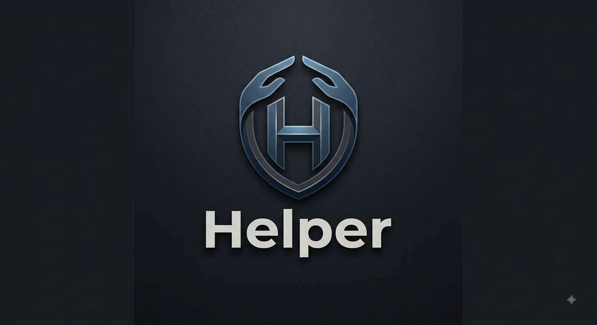

# Helper

Личный PWA-помощник: питание с распознаванием по фото, вода/шаги/настроение, календарь смен, бюджет и долги, менеджер паролей с TOTP. Всё хранится в браузере в зашифрованном виде, без бэкенда.

<p align="center">
  
</p>

## Что внутри

**Питание.** Текстом или фото описываете, что съели — запрос уходит в Gemini (`gemini-2.5-flash` с фолбэком на несколько других моделей серии, если модель недоступна или лимит исчерпан), в ответ прилетают калории и БЖУ. Приложение само делит приёмы пищи на полезные/вредные и считает баланс рациона за день.

**Здоровье.** Вода и шаги — кнопками с быстрым добавлением, вес — отдельная карточка с трендом и спарклайном за последние записи. Настроение фиксируется эмодзи с таймлайном по дню. На вкладке профиля считается суточная норма калорий и воды по формуле Миффлина — Сан-Жеора (пол, возраст, рост, вес, активность, цель — похудение/поддержание/набор).

**Смены.** Шаблон чередования (день/ночь/выходной) применяется на календарь до конца месяца, дальше дни переключаются вручную. По дневной и ночной ставке считается зарплата за месяц.

**Бюджет и долги.** Доходы и расходы по категориям, месячный лимит с индикатором остатка, календарь операций по дням, поиск и фильтры по истории. Отдельно — кто должен вам и кому должны вы, с общим сальдо.

**Пароли и 2FA.** Хранилище шифруется на клиенте (CryptoJS `AES.encrypt` мастер-паролем) и лежит в `localStorage`; без пароля прочитать нечего. Для записей с TOTP-секретом (Base32) коды считаются прямо в браузере через HMAC-SHA1, обновляются каждые 30 секунд. Есть генератор паролей с настраиваемым набором символов и индикатор стойкости.

**Файлы и видео.** Публичный файлообменник кладёт файл (до 15 МБ) в GitHub-репозиторий через Contents API и сокращает ссылку через TinyURL. Загрузчик TikTok берёт видео по ссылке через tikwm.com и даёт сохранить его в галерею без водяного знака.

**Синхронизация.** Зашифрованная база одной кнопкой уходит в приватный GitHub-репозиторий (`encrypted_helper_backup.json`) и оттуда же восстанавливается на другом устройстве — сервер видит только шифротекст. Есть и обычный экспорт/импорт JSON-файлом, плюс выгрузка CSV-отчёта за произвольный период.

## Настройка

В разделе «Настройки» нужно указать:

- **Google AI Studio API key** — для анализа еды по фото/тексту.
- **GitHub Personal Access Token** с правом `repo` — для бэкапов и файлообменника.
- **Репозиторий бэкапов** (приватный, `username/repo`) и **репозиторий файлов** (публичный).

Ключи хранятся вместе с остальными данными внутри зашифрованного хранилища, а не в открытом виде.

## Установка на телефон

iOS (Safari): «Поделиться» → «На экран «Домой»».
Android (Chrome): меню (три точки) → «Установить приложение».

Офлайн работает за счёт `sw.js` — статика кэшируется, HTML обновляется по сети с откатом на кэш при отсутствии соединения.

## Устройство

Статическое приложение без сборки: `index.html`, `app.js`, `styles.css`, `experience.js`, `experience.css` и `kyd-connector.js`. CryptoJS 4.1.1 поставляется локально в `vendor/` с лицензией; подключение к CDN не требуется. Данные лежат в `localStorage` браузера — если очистить хранилище без предварительного бэкапа, всё пропадёт безвозвратно.


## Helper 2.0

- Экран «Сегодня»: незавершённые задачи, баланс текущего месяца, сегодняшняя смена.
- Быстрая запись еды, 250 мл воды, шагов и веса. Записи здоровья относятся к выбранной дате.
- Боковое меню на компьютере, нижняя навигация на телефоне. Масштабирование страницы разрешено, уменьшенная анимация учитывается.
- Резервные копии свёрнуты в отдельный блок; CSV и личные нормы доступны через «Ещё».
- Старый ключ `encMasterData` и формат шифрования сохранены. Перед обновлением рекомендуется экспортировать текущий бэкап.

## KYD как источник данных

Helper не заменяет KYD и не копирует его симулятор. В настройках можно подключить публичный профиль KYD. Карточка показывает процент погашения, остаток (если он открыт в KYD), прогноз и время получения данных. Обновление — вручную. Сводка хранится внутри существующего зашифрованного хранилища Helper и входит в его резервную копию.

Для живого подключения сначала установите API из сопутствующих изменений KYD: `src/app/api/public/helper/[slug]/route.ts` и `src/lib/helper-summary.ts`. Подробности — в `KYD/docs/HELPER-INTEGRATION.md`. На старой версии KYD подключение ещё не заработает.

Затем вставьте в настройках Helper ссылку `https://ваш-kyd.ru/p/имя`. Нужен публичный профиль: скрытые суммы API не передаёт. Доступ к приватному аккаунту, платежи и запись в KYD не реализованы. Токен Telegram-бота и пароль KYD вводить не нужно.

Сводка не смешивается с долгами и бюджетом Helper. При неудачном обновлении старые суммы скрываются; отключение удаляет сохранённую сводку. Снимки из JSON можно загрузить вручную; они не обновляются и отражают дату источника. Ранее скачанные файлы нельзя отозвать изменением приватности в KYD.

## Локальный запуск и проверки

```sh
python -m http.server 8765 --bind 127.0.0.1
# Открыть http://127.0.0.1:8765
npm test
npm run check
```

Установка npm-зависимостей для Helper не нужна. Для тестов нужен Node.js 22+.
Для публикации скопируйте HTML, CSS, JS, manifest, иконку и папку `vendor/` на HTTPS-хостинг, сохранив пути. Все файлы версии должны публиковаться вместе. При следующих изменениях статики увеличивайте CACHE_VERSION в sw.js.

## Graphify

```sh
python -m pip install graphifyy
python -m graphify extract . --code-only
python -m graphify query "showSection renderExperience"
python -m graphify affected saveEncrypted
python -m graphify god-nodes
python -m graphify explain connectKYD
python -m graphify cluster-only . --no-label
python -m graphify export html
```

`graphify-out/` исключён из Git. Правила дальнейшего анализа закреплены в `AGENTS.md`. JavaScript вынесен из HTML, чтобы структурный анализ видел функции и их вызовы. Граф не заменяет проверку исходников и не гарантирует обнаружение динамических обработчиков.
